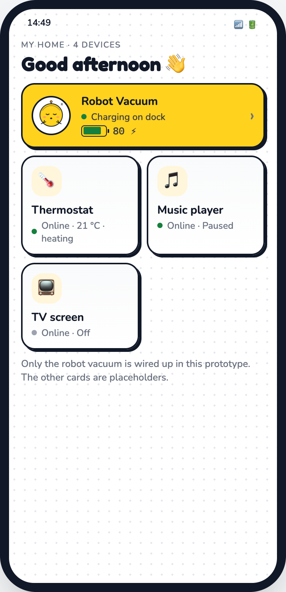
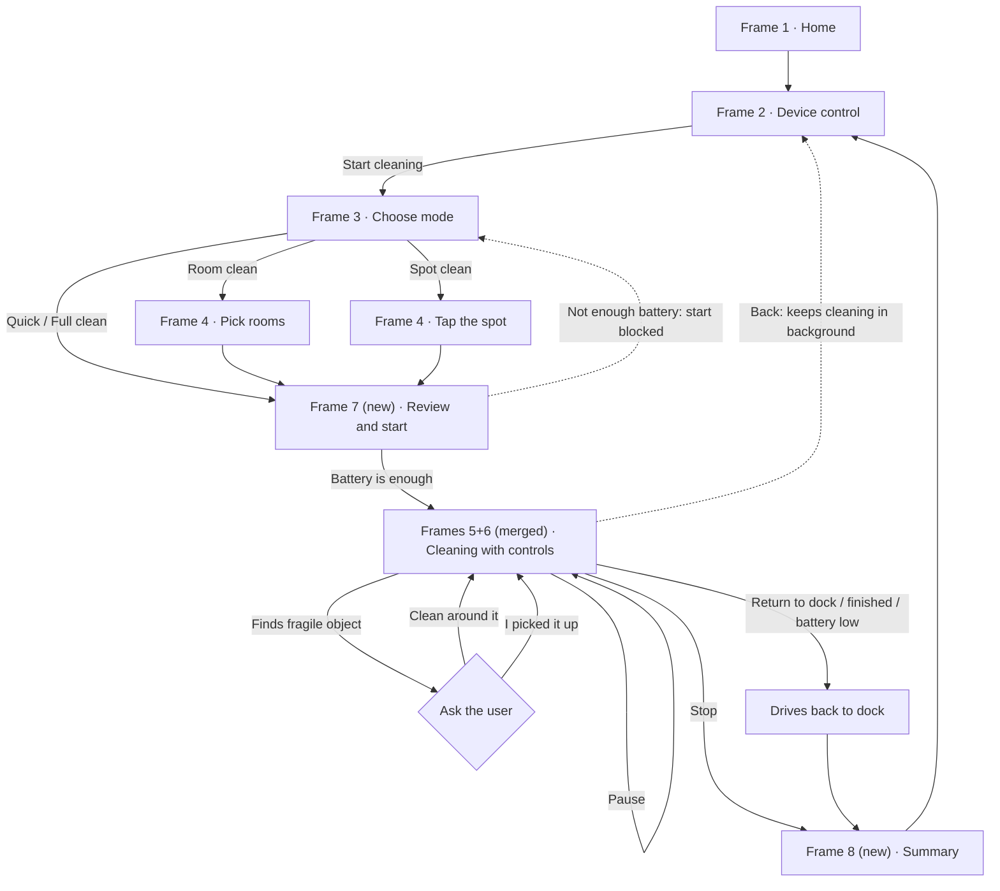
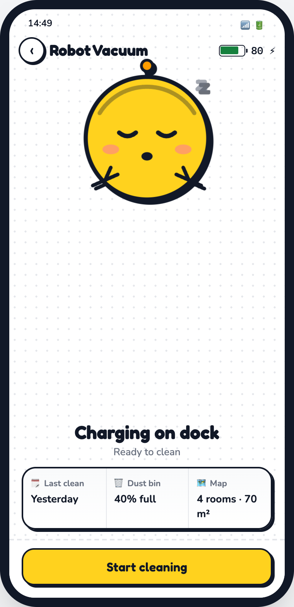
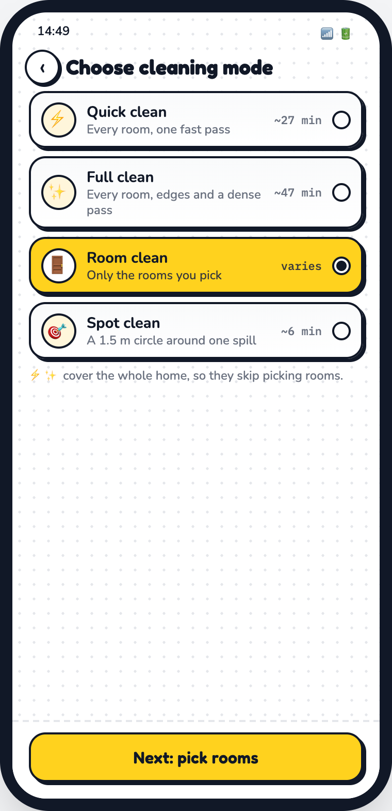
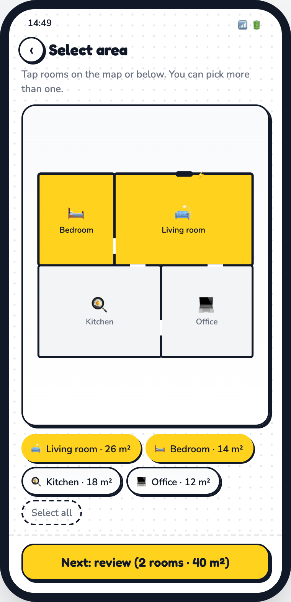
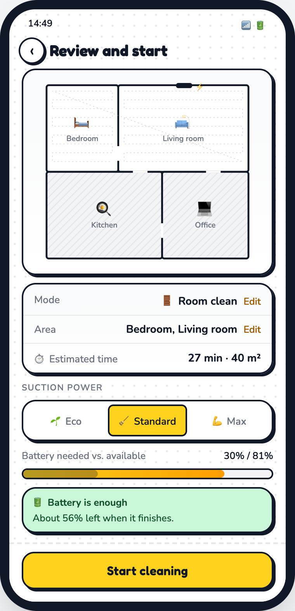
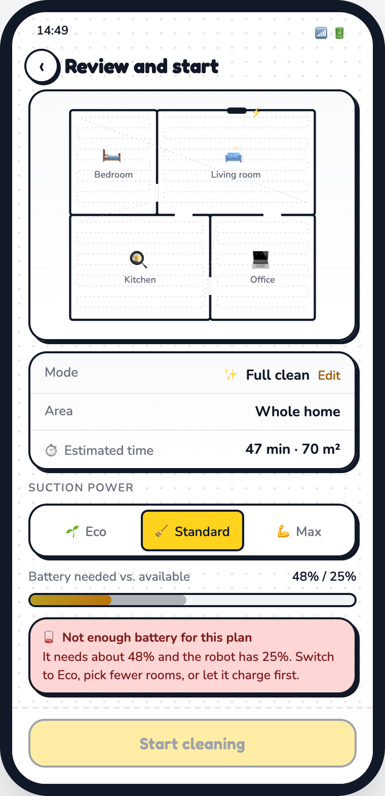
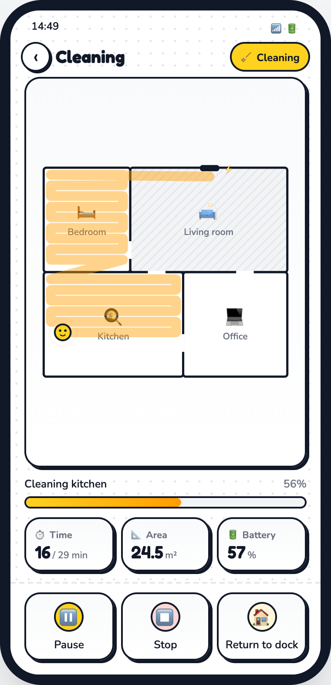
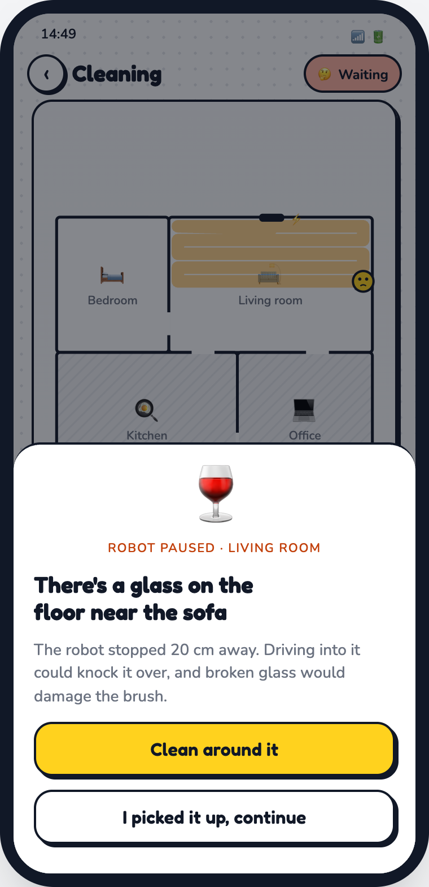
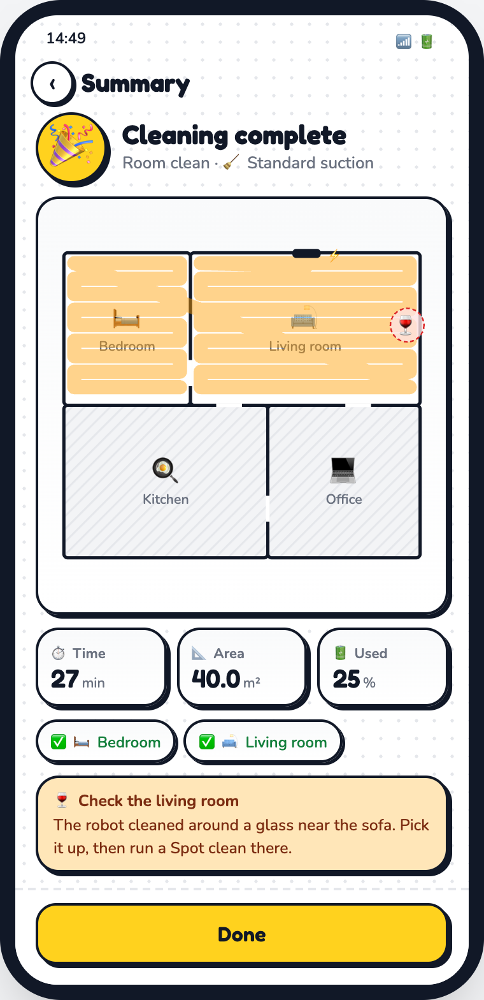

# Robot Vacuum App Prototype

A clickable phone prototype of a robot vacuum app, built from a hand-drawn 8-frame storyboard.

**Live demo:** https://yg674-dev.github.io/personal-projects/robot-vacuum-prototype/



---

## 1. Business goal

A robot vacuum is only worth buying if the owner trusts it to run while they are **not watching**. Most owners do not stop using one because it cleans badly. They stop because it does something they did not expect: it starts a job it cannot finish, it gets stuck, or it drives into something fragile. After that they only run it while they are home, and then it saves them no time.

So the app's job is to earn that trust. The owner should know what the robot will do before it starts, see what it is doing while it runs, and be asked before it does anything risky. Adding cleaning modes or claiming better suction is **not** the point. The point is that every run ends in a state the owner predicted.

## 2. Problem

The original storyboard had the right screens but three gaps in the logic:

| Gap in the sketch | What goes wrong for the user |
|---|---|
| **Start** on the device screen begins a clean before any mode or area is chosen | The robot does something the user did not choose |
| No check between choosing a mode and the robot moving | A plan the battery cannot finish starts anyway and dies halfway |
| Pause / Stop / Return to dock live on a separate screen (frame 6) | To stop the robot, the user has to leave the map that shows what it is doing |
| The flow ends while the robot is still cleaning; frames 7 and 8 were blank | The user never learns what got cleaned, what got skipped, or what needs a look |

The team's bad-scenario storyboard adds a fifth gap: the robot knocks over glassware on a carpet and vacuums up the broken glass.

## 3. Users and jobs to be done

**Primary user:** a busy apartment dweller who wants the floor cleaned while they work or are out.

- *When I start a clean,* I want to choose what gets cleaned and know how long it will take, so I don't come back to a half-done job.
- *While it runs,* I want to see where it is and stop it in one tap, so I feel in control even from another room.
- *When it finds something it shouldn't touch,* I want it to ask me first, so it doesn't break things.
- *When it's done,* I want a short report, so I know whether anything needs my attention.

## 4. Goals and non-goals

**Goals**
- Every clean starts from an explicit mode and area choice.
- No clean starts that the battery cannot finish.
- Pause, stop and return are one tap from the live map.
- The robot asks before it touches fragile objects.
- Every run ends with a summary.

**Non-goals**
- Scheduling, multi-floor maps, map editing and no-go zones
- Real device connection. The robot, battery and map are simulated in the browser.
- The thermostat, music player and TV. They stay as placeholders from frame 1.

## 5. User journey



The flowchart's main rule: **the robot only moves after a step where the user can see the whole plan** (Frame 7). After that, it only changes course in response to a user decision: pause, stop, return to dock, or an answer to the fragile-object prompt. Quick and Full clean skip area selection, because they always cover the whole home.

### Step by step

1. **Home.** The vacuum card shows live status and battery, so a clean in progress is visible without opening it.
2. **Device control.** Shows the battery, the robot's state (charging, ready, cleaning, paused, returning, stopped) and one main action that depends on that state.
3. **Choose mode.** Pick one of four modes. Each shows what it covers and an estimated time. The button names the next step.
4. **Select area** (Room and Spot only). Tap rooms on the map (you can pick several), or tap the spot to clean.
5. **Review and start.** Shows the path preview, the time estimate and the suction choice, and checks the battery. If the battery can't finish the plan, Start is disabled and the screen suggests a fix.
6. **Cleaning.** The robot moves along its path on the map, and time, area and battery update live. Pause, Stop and Return to dock sit under the map.
7. **Summary.** Shows time, area, battery used, which rooms were finished, and anything to check.

---

## F1 · Home and device control (frames 1–2)



- **Live status on the home card:** "Cleaning kitchen · 56%" appears on the card itself.
- **The robot's face follows its state:** asleep while charging, smiling while cleaning, worried when it finds the glass.
- **Start opens the mode picker** instead of starting a clean straight away.
- **Below 20% battery, Start is disabled** and reads "Charging. Ready at 20%".

## F2 · Choose mode (frame 3)



| Mode | Covers | Est. time | Next step |
|---|---|---|---|
| ⚡ Quick clean | Every room, one fast pass | ~27 min | Review |
| ✨ Full clean | Every room, edges and a dense pass | ~47 min | Review |
| 🚪 Room clean | Only the rooms you pick | depends on rooms | Pick rooms |
| 🎯 Spot clean | 1.5 m circle around one spill | ~6 min | Tap the spot |

## F3 · Select area (frame 4)



- Rooms can be toggled on the map or with the chips below it. There is also a Select all option.
- The button shows the room count and area. It stays disabled until at least one room is picked.
- In Spot mode, tapping the map drops a 1.5 m cleaning circle. Tapping somewhere else moves it.

## F4 · Review and start (new, frame 7)

| Battery is enough | Battery is not enough |
|---|---|
|  |  |

- **Battery needed** = estimated minutes × drain rate × suction multiplier (Eco 0.6, Standard 1.0, Max 1.6) + a 5% reserve for the trip back to the dock.
- If the robot doesn't have that much battery, **Start is disabled** and the message suggests what to change: Eco suction, fewer rooms, or charging first.
- Edit links on Mode and Area jump straight back to that step.

## F5 · Cleaning with controls (frames 5 + 6 merged)

| Cleaning | Fragile object found |
|---|---|
|  |  |

- **Pause** becomes **Resume**. **Stop** asks for confirmation and leaves the robot where it is. **Return to dock** ends the run and drives the robot home.
- **Going back keeps the robot cleaning.** If it needs input while you're on another screen, a banner appears there.
- **Fragile-object prompt.** This comes from the team's bad-scenario storyboard. The robot stops 20 cm from the glass and waits for you. "Clean around it" marks a keep-out circle on the map and lists it in the summary.
- **Low battery.** If the battery reaches the reserve level mid-run, the robot drives back to charge on its own.

## F6 · Summary (new, frame 8)



- The title and icon depend on how the run ended: 🎉 complete, ✋ stopped, 🏠 sent back early, 🪫 paused for charging.
- Each room shows whether it was finished.
- Anything the robot avoided is called out with a next step ("Pick it up, then run a Spot clean there").
- If the robot was stopped away from the dock, the summary offers **Send back to dock**.

---

## Success metrics (for a usability test of this prototype)

| Metric | Target |
|---|---|
| Starts a 2-room clean with no help | ≥ 90% of participants |
| Time from Home to a running clean | < 30 s |
| Can find Pause while the robot is running | ≥ 95%, first try |
| Can say afterwards which rooms were cleaned | ≥ 90% |
| **Guardrail:** cleans started that the battery could not finish | **0** |
| **Guardrail:** runs left in "Waiting" for more than 10 min because the prompt went unanswered | Track it. If it is high, asking first makes the robot useless when nobody is home. |

The second guardrail tracks the cost of the safety feature. Each time the robot asks instead of acting, it stops while the user is away, which is the case the business goal cares about.

## Risks and open questions

- **False alarms.** If the robot flags too many harmless objects, users will want to turn detection off. Should "clean around it" become the automatic default after a few minutes without an answer?
- **The battery estimate is a simple formula.** A real version would learn drain rates from past runs, per room and per floor type.
- **Stop vs. Return to dock.** Test participants may not see the difference. Do both need to stay?

## What's in this repo

```
robot-vacuum-prototype/
├── index.html          # The whole prototype: HTML, CSS and JS in one file, no build step
├── README.md
└── docs/screens/       # Screenshots used above
```

**Run it locally:** open `index.html` in a browser. Everything is simulated in the page.

**Built with:** vanilla JS and inline SVG for the floor plan and robot. Colors follow the Hugging Face palette (`#FFD21E` yellow, `#FF9D00` orange, Tailwind grays). Fonts are Fredoka and Nunito from Google Fonts. It supports light and dark mode.
